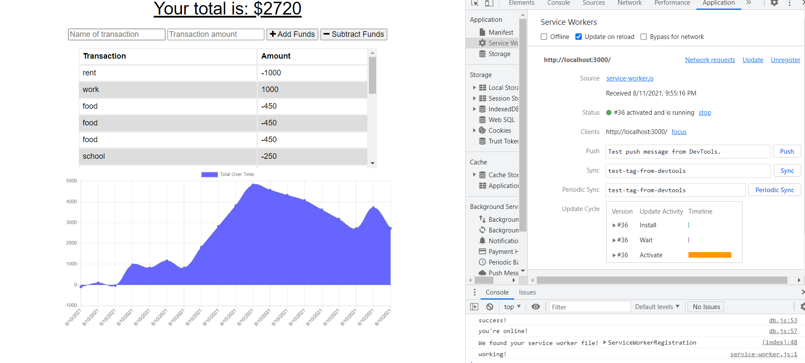
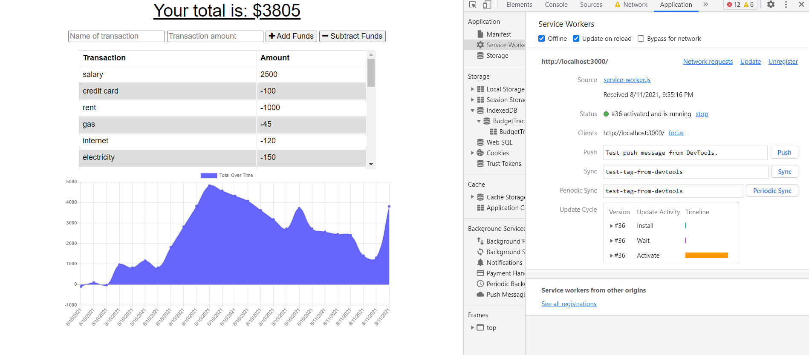
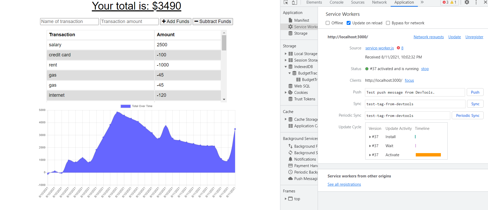

# PWA-budget-tracker

## Description:
The purpose of this excercise was to add functionality to starter code in order to add an offline functionality to a web app. This app in question was fully functional online, but came missing components to store data locally. This involved creating a webmanifest which instructs a browser how to install a given app into the browsers local storage and cache. The service worker file was next, acting as a pseudo backend for the app to function offline to properly cache files, and to push it and stored data to the backend once a connection has been re-established. Finally the db.js file was creating as an indexedDB (native to chrome) in order to hold the stored JSON data while the app is offline. These three files in conjunction allow a user a seemless experience with app, even if they were to disconnect from the internet. The data in question was used to store, adjust, and track a budget, taking in an action and a $ amount, adding or subtracting it from the total and displaying the current balance along with a graph showing each transaction.

## Technologies Utilized:
- Javascript
    -Utilizing:
    -A Webmanifest
    -A Service Worker
    -An indexed DB
- Node 
- NPM package
- Express server
- Mongoose
- GraphQL
- Heroku

## Installation & Use:

### To install necessary packages:
- While in the directory, type in command line: npm i

### To start the server:
- While in the directory, type in command line: npm start

## Screenshots:
### Online - Start

### Offline - modify budget

### Reload with data persisting

## Challenges & Thoughts:
- I had some issues with their being errors in the console log claiming I have issues with fetching a POST route, however everything seems to be functioning correctly on front and back end, working offline as intended, getting '200' responses on the backend as well while online. This seems like a useful practice for any application using a shopping cart or anything a user could come back to and use after a prolong period away.

## Questions/Links:
https://github.com/MarkAndersen

[Email me](mailto:Mark.Andersen75@gmail.com)
